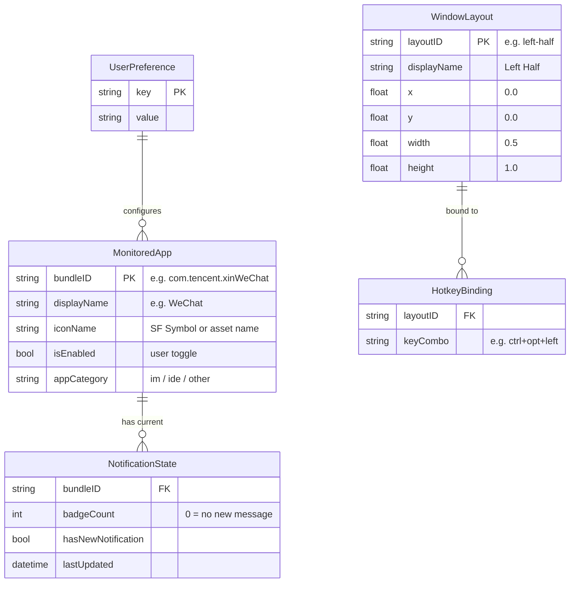
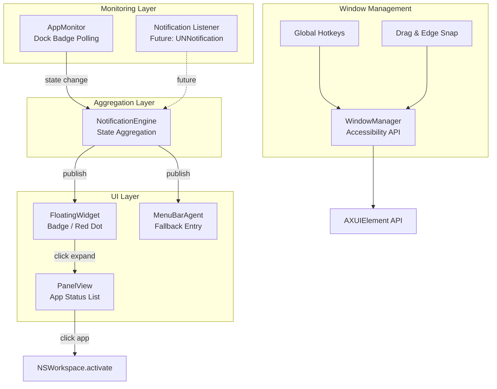

# 系统架构与业务上下文 — NARC for Mac

## 🎯 业务最终目标
**NARC (Notification & Application Resource Center)** 是一个原生 macOS 桌面悬浮窗应用，充当统一的"通知中心 + 状态面板 + 窗口管理"入口。

**核心价值**：用户无需在多个应用间切换，即可通过一个常驻桌面的悬浮窗感知所有关键工作状态变化（IM 新消息、IDE 任务完成等），点击后展开面板查看详情并快速跳转到对应应用处理。同时集成窗口管理能力（类似 Magnet），提供分屏与拖拽吸附。

**产品形态**：桌面悬浮窗（小圆点/图标） + 点击展开的详情面板 + 菜单栏备用入口。

## 🧩 核心模块划分
| 模块名 | 职责描述 | 对外暴露接口 | 依赖的其他模块 |
|--------|---------|-------------|---------------|
| **FloatingWidget** | 桌面悬浮窗 UI，常驻显示，支持拖拽移动，展示聚合状态（红点/badge） | `show()`, `hide()`, `updateBadge()` | NotificationEngine |
| **PanelView** | 展开面板 UI，展示被监控 App 的状态列表，支持点击跳转 | `expand()`, `collapse()` | FloatingWidget, AppMonitor |
| **AppMonitor** | 应用监控引擎，监控目标 App 的 Dock badge 变化，检测新消息 | `startMonitoring()`, `stopMonitoring()`, `onStateChange` callback | — |
| **WindowManager** | 窗口管理模块，注册全局快捷键，通过 Accessibility API 操控窗口位置/大小 | `registerHotkeys()`, `moveWindow()`, `snapToEdge()` | — |
| **PreferenceStore** | 用户偏好管理，存储/读取监控配置、快捷键绑定、UI 偏好 | `get()`, `set()`, `reset()` | — |
| **MenuBarAgent** | 菜单栏常驻图标，作为悬浮窗的备用入口（全屏模式下可用） | `showMenu()`, `updateIcon()` | NotificationEngine |
| **NotificationEngine** | 通知聚合引擎，汇总各监控源的状态变化，统一推送给 UI 层 | `subscribe()`, `publish()` | AppMonitor |

## 🗄️ 核心数据模型

## 🔀 核心数据流 / 状态管理

## ⚡ 非功能性需求 (NFR)
| 指标 | 目标值 | 备注 |
|------|--------|------|
| **CPU 空闲占用** | < 1% | Polling interval ≥ 2s |
| **内存占用** | < 50 MB | 常驻运行，轻量级 |
| **Badge 检测延迟** | < 3s | 从 App 收到消息到悬浮窗显示红点 |
| **窗口操作响应** | < 100ms | 快捷键触发到窗口移动完成 |
| **启动时间** | < 1s | 冷启动到悬浮窗可见 |

## 🚀 部署拓扑

- **平台**: macOS 14 Sonoma+ (原生 Swift/SwiftUI)
- **分发方式**: Developer ID 签名 + Apple Notarization + GitHub Releases
- **不上架 Mac App Store**（避免沙盒限制，保留 Accessibility API 完整能力）
- **CI/CD**: GitHub Actions (build → sign → notarize → release)
- **自动更新**: Sparkle framework (未来考虑)

## 📐 架构决策记录 (ADR) 索引
| # | 日期 | 决策 | 原因 | 状态 |
|---|------|------|------|------|
| 1 | 2026-03-30 | 确立 Vibe Coding 护栏机制 | 为 AI 辅助编码建立工程规范约束 | ✅ 生效 |
| 2 | 2026-04-09 | 引入三层记忆模型 (Session/Project/Global) | 参考 three-layer-memory-skill，解决记忆扁平化问题 | ✅ 生效 |
| 3 | 2026-04-09 | ~~确立"个人基础设施层"双仓库模型~~ → 已被 ADR-007 取代 | — | ❌ 废弃 |
| 4 | 2026-04-09 | `brain init` 一键加载 + 验证闭环 | 防止"加载了脚手架但没真正起作用" | ✅ 生效 |
| 5 | 2026-04-09 | 全局记忆只放采控记录 | 项目特有技术选型不放全局，只放跨项目通用偏好 | ✅ 生效 |
| 6 | 2026-04-09 | 检索优先原则 (Search-First) | 避免全量读取浪费 context window | ✅ 生效 |
| 7 | 2026-04-14 | 确立"单仓库双职能"模型 (Harness + Brain 合并)（取代 ADR-003） | 避免双仓库同步复杂度，统一管理 | ✅ 生效 |
| 8 | 2026-04-14 | 多平台写入策略 (IDE/CLI/Webhook) | 支持从 Cursor/Trae/Claude Web/ChatGPT 等多源写入 | ✅ 生效 |
| 9 | 2026-04-15 | 采用原生 macOS (Swift/SwiftUI) 技术栈 | 系统集成最深，Accessibility API 完整支持，性能最优 | ✅ 生效 |
| 10 | 2026-04-15 | 不上架 Mac App Store，GitHub Releases 分发 | 避免沙盒限制，保留窗口管理和进程监控的完整能力 | ✅ 生效 |
| 11 | 2026-04-15 | MVP 阶段 IM 监控采用 Dock Badge 方案 | 最轻量，无需 hack IM App 内部；架构预留通知中心拦截扩展点 | ✅ 生效 |
| 12 | 2026-04-15 | IDE 任务状态监控延后至 P2 | MVP 聚焦核心三大功能，IDE 桥接方案待 MVP 验证后再定 | ✅ 生效 |
| 13 | 2026-04-15 | 插件/扩展机制延后，但架构预留扩展点 | MVP 先跑通核心功能，避免过早抽象 | ✅ 生效 |
