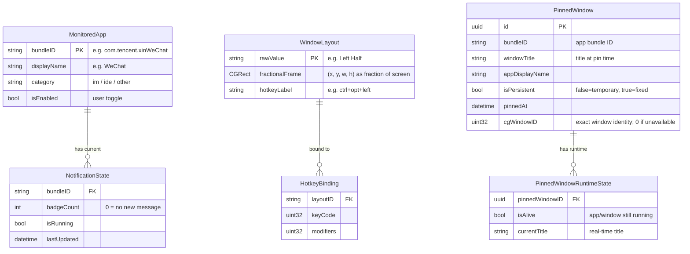
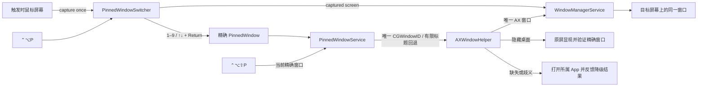
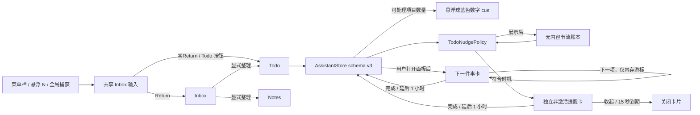
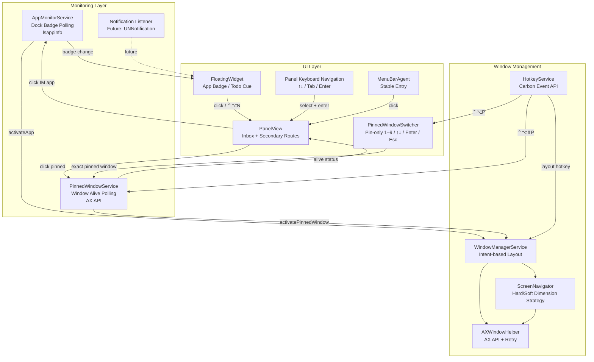

# 系统架构与业务上下文 — NARC for Mac

## 🎯 业务最终目标
**NARC** 是一个原生 macOS 本地个人助手：用顶部菜单栏提供稳定入口，用桌面悬浮 `N` 把捕获、注意力提示和高频动作放回用户当前屏幕。

**核心价值**：用户无需离开当前工作，即可随手记录 Inbox/Todo/Note、看到目标 App 向 macOS 暴露的应用级未读、处理当前 Todo，并召回或排列窗口。应用级未读只读取 Dock Badge，不读取消息正文或承诺会话级状态。

**产品形态**：顶部菜单栏 + 桌面悬浮 `N` 的双入口；轻量面板负责当下捕获和处理，独立 Assistant 窗口负责完整管理。菜单栏不是备用入口，悬浮球也不会被其取代。

## 🧩 核心模块划分
| 模块名 | 职责描述 | 对外暴露接口 | 依赖的其他模块 |
|--------|---------|-------------|---------------|
| **FloatingWidget** | 桌面悬浮窗 UI，常驻显示，支持拖拽移动；右上应用未读与左下蓝色 Todo 数量 cue 使用两条独立状态轴 | `show()`, `hide()`, `updateBadge()` | AppMonitor, AssistantStore |
| **TodoNudge** | 评估启动暖机、Todo 静默期、冷却与每日上限，并用独立 nonactivating 卡片在悬浮球旁呈现一项 Todo | `evaluate()`, `present()`, `dismiss()` | FloatingWidget, AssistantStore, UserDefaults |
| **PanelView** | 展开面板 UI；默认 Inbox 按状态在“下一件事”与捕获之间确定主视觉，待整理记录默认折叠；Notifications/Windows 为次级路由 | `expand()`, `collapse()`, keyboard route | FloatingWidget, AppMonitor, AssistantStore, PinnedWindowService |
| **PinnedWindowSwitcher** | 键盘优先的独立 Pin 召回器；在触发时捕获鼠标屏幕，立即消费 `1–9`、方向键、Return 与 Esc，数字槽位只对应 Pin | `present(on:)`, `dismiss()`, `handleKeyEvent()` | HotkeyService, PinnedWindowService, AXWindowHelper |
| **AssistantStore** | Inbox、Todo、Notes 的本地唯一状态源；原子写入、schema 迁移、可处理 Todo 派生与延期 | `captureInbox()`, `createTodo()`, `availableTodos()`, `setTodoDeferred()` | FileManager |
| **SelectedTextTodoCapture** | 快捷键触发时锁定来源 PID 与焦点控件，后台读取一次标准 AX 选区，执行长度策略、原子创建与精确撤销 | `capture()`, `confirmPendingCapture()`, `undo()` | HotkeyService, AssistantStore, Accessibility |
| **AppMonitorService** | 轮询目标 App 通过 LaunchServices 暴露的 Dock Badge，聚合应用级未读和未知态；不读取消息正文或推断具体会话 | `startMonitoring()`, `stopMonitoring()`, `activateApp()` | WindowManagerService |
| **PinnedWindowService** | 窗口固定服务，按稳定 Pin 顺序管理精确窗口，支持标记/取消、存活轮询和持久化；精确窗口优先，可见桌面移屏、隐藏桌面原屏显现，精确失败时明确降级为打开所属 App | `toggleCurrentWindowPin()`, `unpin()`, `activatePinnedWindow()` | WindowManagerService |
| **WindowManagerService** | 窗口管理核心，意图式布局（Magnet 风格），支持 10 种布局 + 多显示器跨屏切换 + 窗口召唤 | `moveActiveWindow()`, `summonAppWindow()`, `findAppWindow()` | AXWindowHelper, ScreenNavigator |
| **ScreenNavigator** | 多显示器导航，检测窗口所在屏幕、判断窗口是否已在目标布局（硬/软维度策略）、计算跨屏入口布局 | `isWindowAtLayout()`, `adjacentScreen()`, `crossScreenEntryLayout()` | AXWindowHelper |
| **HotkeyService** | 全局快捷键注册（Carbon Event API），管理布局、`⌃⌥P` Pin 召回器、`⌃⌥⇧P` 标记/取消、悬浮球召回、捕获和可配置划词 Todo 快捷键，并监测辅助功能授权变化 | `registerGlobalHotkeys()`, `updateSelectedTextTodoShortcut()`, `requestAccessibilityPermission()` | — |
| **AXWindowHelper** | Accessibility API 底层工具，窗口属性读写、坐标转换（NS↔AX）、布局帧计算、原生全屏检测 | `setFrame()`, `calculateLayoutFrame()`, `screenForWindow()` | — |
| **PreferenceStore** | 用户偏好管理，存储/读取应用监控配置、快捷键、悬浮球与 Pin 窗口状态；旧过滤模型不属于当前用户承诺 | `get()`, `set()`, `reset()` | — |
| **MenuBarAgent** | 菜单栏稳定入口，承载应用级未读，并召回悬浮球或打开工具菜单 | `showMenu()`, `updateIcon()` | AppMonitorService |

## 🗄️ 核心数据模型

## 🔀 核心数据流 / 状态管理

## v2.0.0 · 2026-09-15 · 固定窗口键盘召回架构

`⌃⌥P` 不再执行标记，而是打开独立 `PinnedWindowSwitcher`。选择器在 Carbon 动作进入时锁定鼠标所在显示器，并在该显示器可见区域内呈现；它成为当前 key window 后，只在自己的窗口边界内消费 `1–9`、方向键、Return 与 Esc。数字键直接映射 Pin 列表的前九项，第十项继续可由方向键或鼠标访问；监控 App 的运行数量不再参与 Pin 索引，也不会改变数字含义。

Pin 的显示与键盘顺序沿用持久化数组的现有顺序，不使用运行中监控 App、窗口标题变化或最近使用时间自动重排。低频的 `⌃⌥⇧P` 对触发时的前台精确窗口执行标记/取消；相同非零 CGWindowID 视为同一窗口，无法取得 ID 时才使用 Bundle ID 与标题作为有限回退。回退若命中多个候选，停止精确移动；按 2026-09-16 修订，仍允许打开所属 App，但不能冒充精确窗口成功。

选择器打开时捕获的目标显示器贯穿本次选择。`PinnedWindowService` 先按 CGWindowID 解析精确 AX 窗口；仅召回开始时已位于可见桌面且可确认不是原生全屏的窗口，才交给 `WindowManagerService.summonWindow(_:toScreen:)`。其他桌面的窗口保留原位置，经 `AXMain` / `AXFocusedWindow` / `AXRaise` 与 AppKit cooperative activation 请求显现。AX 暂时空列表时通过公开的 `NSWorkspace.openApplication` 复用 App 的正常打开路径，再有界重查；不再运行 AppleScript 或私有 CGS 跨 Space 操作，也不依赖 CG 窗口标题。运行中恢复等待 2 秒，冷启动等待 10 秒；所有后续回调校验 generation 与一次性完成状态。

精确成功同时要求目标 App 为前台、焦点窗口 ID 正确，以及该 ID 出现在系统 on-screen 窗口列表；若显示器不是请求屏幕，结果为原屏显现。到期后仅所属 App 活跃且有可见窗口时报告应用级打开；活跃却无可见窗口单独提示，不能报告召回成功。AppDelegate 保留这些分级结果的目标焦点，仅实际失败才恢复原 App。不会因为一次降级自动重绑持久 Pin。

这一路径首版即使只有一个 Pin 也显示选择器，避免静默改变快捷键语义；不注册全局数字键、不引入新依赖，也不把 Pin 合并回默认 Inbox 面板。现阶段这是已锁定并进入实现的 v2.0 架构，专项自动测试、真实双屏多窗口和跨 Space 体验仍须取得证据后才能标记为可用或完成。

## v2.0.0 · 2026-09-14 · Inbox 焦点与主动提醒架构

`AppDelegate` 只持有一个 `AssistantStore`，并把同一实例注入悬浮球、面板、Quick Capture、划词捕获、Assistant 与提醒卡。Compact Inbox 直接从该状态源派生层级：存在可处理 Todo 时先渲染“下一件事”，否则输入区位于第一位；待整理 Inbox 只在用户展开摘要后渲染记录操作。

Todo cue 只显示可处理数量，不包含正文，也不复用应用未读 Badge。主动提醒不会调用 `showPanel()`，而是使用独立 borderless nonactivating panel；窗口不成为 key/main window，呈现时不调用 App 激活路径。卡片复用与主面板相同的完成/延期写盘动作，成功后关闭；失败时保留错误反馈，不能伪装成完成。

`TodoNudgePolicy` 是纯时间与状态判定：启动暖机 30 秒、Todo 变化后静默 15 分钟、展示 15 秒、展示后冷却 2 小时、每天最多 3 次。主面板、Quick Capture、Assistant 等 NARC 管理界面可见或悬浮球拖动时直接阻止呈现。标准数据路径把当日起点、展示次数和下次允许时间写入 `UserDefaults`；账本不保存正文或 UUID。隔离/临时 Assistant 数据使用内存账本，避免开发验证消耗真实用户提醒配额。

这条路径不接入 AI、账号或网络，不增加 Accessibility、通知或屏幕录制权限，也不调用系统通知或声音。当前架构已进入可体验预览；信息层级、首次点击不激活与提醒强度仍须真实体验确认后才能视为正式验收。

### v2.0.0 · 2026-09-11 · 划词捕获边界

`⌃⌥T`（或用户选择的安全预设）由 Carbon 同步分发。处理器先锁定触发时的前台 PID 与焦点 AX 元素，再把对该元素及最多 7 层父级的一次标准选区读取放到专用串行队列；单次 AX 消息有超时，范围回退与最终文本都限制为 65,536 个 UTF-16 文本单元。读取完成后才形成不可重读的快照：短文本原子写入，长文本确认使用同一快照，成功反馈只保留精确撤销 UUID。该路径不读取剪贴板、不模拟输入、不遍历 children，也不调用 OCR、AI、网络或私有 API。

### 应用级状态与窗口路径

## ⚡ 非功能性需求 (NFR)
| 指标 | 目标值 | 备注 |
|------|--------|------|
| **CPU 空闲占用** | < 1% | Polling interval ≥ 2s |
| **内存占用** | < 50 MB | 常驻运行，轻量级 |
| **Badge 检测延迟** | < 3s | 从目标 App 向 macOS 暴露 Badge 到 NARC 刷新应用级状态 |
| **窗口操作响应** | < 100ms | 快捷键触发到窗口移动完成 |
| **启动时间** | < 1s | 冷启动到悬浮窗可见 |

## 🚀 部署拓扑

- **平台**: macOS 14 Sonoma+ (原生 Swift/SwiftUI)
- **交付方式**: GitHub 源码一条命令，本机生成并放置 `~/Applications/NARC.app`
- **本地 Bundle**: 目标位置已有可验证 NARC 且对应私钥仍可用时，普通安装先继承其本地 signer（包括旧 `NARC Dev`）；干净新用户才创建 `NARC Local Code Signing Identity v1`。后续只复用由本机指纹标记锁定、且与已安装 App 一致的身份；用“Bundle ID + 证书指纹”的显式 Designated Requirement 签名并严格校验。同一用户的安装由 Application Support 下的内核文件锁跨 clone 串行化，切换前二次核验，信号中断与切换后失败以 App + marker 为一个事务回滚
- **构建隔离**: CI 与一次性开发构建必须显式选择 ad-hoc；普通安装在身份缺失、不匹配、不可访问或签名失败时停止，不得降级
- **明确排除**: DMG、PKG、预编译 App ZIP、GitHub Release 安装包、Developer ID、公证和自动更新框架
- **权限边界**: 手动 Inbox/Todo/Notes、Assistant 浏览与应用级 Badge 无需 Accessibility；划词 Todo、窗口排列与钉选按需请求 macOS 授权并每 3 秒复核，通常无需重启。被权限中断的动作不自动重放，避免读错新选区或把当前系统设置窗口误当为目标；持续拒绝时只报告“仍未获权”并显示当前运行路径，不从布尔结果臆断签名原因
- **密钥边界**: 新建 Local v1 时，私钥以不可导出方式导入当前用户钥匙串，初始访问范围仅授权系统 `codesign`；继承旧身份时不导出或改写私钥。公开 SHA-1 指纹保存在 Application Support，用于检测丢失或轮换且不进入发布产物
- **已接受的本地风险**: 为避免每次源码更新都弹出钥匙串确认，同一用户下的其他进程可能调用系统 `codesign` 使用安装器新建的 Local v1，但不能导出私钥；继承身份保留原访问控制。两类身份都只用于本机 TCC 连续性，不构成发布者或供应链信任

## 📐 架构决策记录 (ADR) 索引
| # | 日期 | 决策 | 原因 | 状态 |
|---|------|------|------|------|
| 1 | 2026-03-30 | 确立 Vibe Coding 护栏机制 | 为 AI 辅助编码建立工程规范约束 | ✅ 生效 |
| 2 | 2026-04-09 | 引入三层记忆模型 (Session/Project/Global) | 参考 three-layer-memory-skill，解决记忆扁平化问题 | ✅ 生效 |
| 3 | 2026-04-09 | ~~确立"个人基础设施层"双仓库模型~~ → 已被 ADR-007 取代 | — | ❌ 废弃 |
| 4 | 2026-04-09 | `brain init` 一键加载 + 验证闭环 | 防止"加载了脚手架但没真正起作用" | ✅ 生效 |
| 5 | 2026-04-09 | 全局记忆只放采控记录 | 项目特有技术选型不放全局，只放跨项目通用偏好 | ✅ 生效 |
| 6 | 2026-04-09 | 检索优先原则 (Search-First) | 避免全量读取浪费 context window | ✅ 生效 |
| 7 | 2026-04-14 | 确立"单仓库双职能"模型 (Harness + Brain 合并)（取代 ADR-003） | 避免双仓库同步复杂度，统一管理 | ✅ 生效 |
| 8 | 2026-04-14 | 多平台写入策略 (IDE/CLI/Webhook) | 支持从 Cursor/Trae/Claude Web/ChatGPT 等多源写入 | ✅ 生效 |
| 9 | 2026-04-15 | 采用原生 macOS (Swift/SwiftUI) 技术栈 | 系统集成最深，Accessibility API 完整支持，性能最优 | ✅ 生效 |
| 10 | 2026-04-15 | ~~不在 App Store 上架，改用 GitHub Releases 分发~~ → 被 ADR-018 取代 | 原方案会引入预编译产物与签名发布链 | ❌ 废弃 |
| 11 | 2026-04-15 | MVP 阶段 IM 监控采用 Dock Badge 方案 | 最轻量，无需 hack IM App 内部；架构预留通知中心拦截扩展点 | ✅ 生效 |
| 12 | 2026-04-15 | IDE 任务状态监控延后至 P2 | MVP 聚焦核心三大功能，IDE 桥接方案待 MVP 验证后再定 | ✅ 生效 |
| 13 | 2026-04-15 | 插件/扩展机制延后，但架构预留扩展点 | MVP 先跑通核心功能，避免过早抽象 | ✅ 生效 |
| 14 | 2026-04-22 | 窗口布局采用「意图形态」策略（Magnet 风格） | 布局快捷键表达空间意图而非精确像素；硬维度（布局控制的轴）严格匹配，软维度（应用可能约束的轴）宽容匹配 | ✅ 生效 |
| 15 | 2026-04-22 | macOS 原生全屏（绿色按钮）自动退出后再应用布局 | 原生全屏窗口在独立 Space 中，AX API 无法直接操控；先退出全屏等动画完成再 apply | ✅ 生效 |
| 16 | 2026-04-22 | AXWindowHelper.setFrame 采用验证+重试+波动检测机制 | Electron 等应用异步处理 resize，需要多次重试并检测尺寸稳定/波动状态 | ✅ 生效 |
| 17 | 2026-04-22 | 面板呼出跟随鼠标所在屏幕（右下角） | 用户按 ⌃⌥N 时面板出现在当前工作屏幕的右下角，而非浮窗所在屏幕 | ✅ 生效 |
| 18 | 2026-08-23 | GitHub 源码一条命令本地准备，不发布安装包 | 降低获取、维护和签名成本；保留本地 App Bundle 以满足 macOS 集成 | ✅ 生效 |
| 19 | 2026-09-07 | 每用户、每台 Mac 创建一次本地签名身份，普通安装失败关闭 | 保留窗口功能，同时让 TCC 用稳定证书 requirement 识别源码更新；不建立可分发签名链 | ✅ 生效 |
| 20 | 2026-09-07 | 迁移时继承既有本地 signer，稳定身份冲突时停止 | 防止旧 `NARC Dev` 授权被新 Local v1 静默切断；已受影响机器使用显式、可回滚恢复 | ✅ 生效 |
| 21 | 2026-09-07 | 本地安装跨 clone 串行化，App 与 signer marker 事务切换 | 阻止并发构建或信号中断重新制造签名错配；失败时恢复旧授权身份 | ✅ 生效 |
| 22 | 2026-09-08 | Todo 延期进入 schema v3，悬浮提示与面板游标保持派生 | 延期必须跨重启且原子保存；“下一项”和 cue 都不应污染任务顺序、应用未读 Badge 或引入 AI/网络依赖 | ✅ 生效 |
| 23 | 2026-09-11 | 划词 Todo 只走显式、有限的标准 AX 读取 | 保持低干扰和隐私边界；不以剪贴板、模拟输入、OCR 或 AI 换取表面兼容率 | ✅ 生效 |
| 24 | 2026-09-14 | Inbox 采用状态驱动层级，主动 Todo 提醒使用独立非激活窗口与无内容节流账本 | 突出当下行动，同时避免主面板自动展开、焦点抢占、系统通知、新权限或提醒状态污染 Assistant schema | 🧪 可体验预览 |
| 25 | 2026-09-15 | Pin 升级为独立键盘召回器，标记动作迁移到 `⌃⌥⇧P` | 消除打开主面板、切换 Tab、再用鼠标点击的成本；保持 Pin-only 稳定数字顺序，并把精确窗口召回到触发时鼠标屏幕 | 🧪 可体验预览 |
