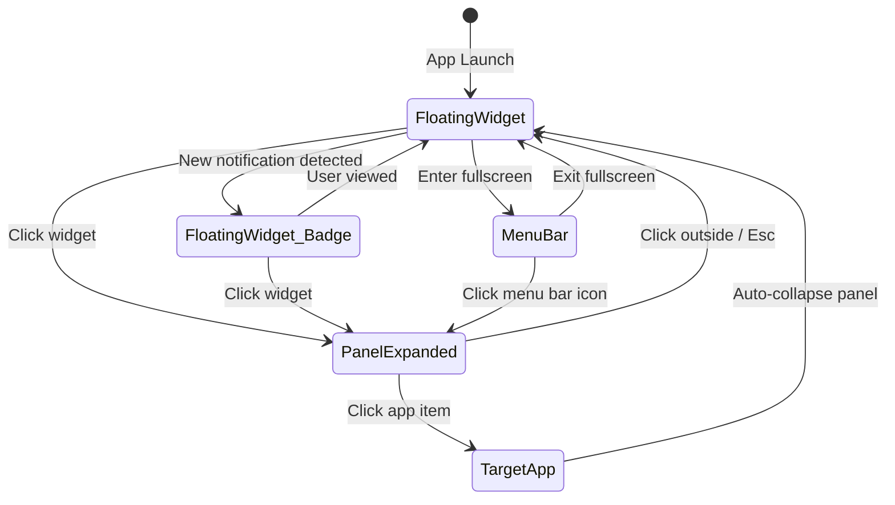

# NARC for Mac — UI Design Specification & Review

## Product Form
A native macOS floating widget app serving as a unified "Notification Center + Status Panel + Window Manager".
- **Primary entry**: Floating widget (draggable circle, always on top)
- **Secondary entry**: Menu bar icon (fallback for fullscreen mode)
- **Interaction**: Click widget → expand panel → view/act → collapse

---

## Global Design Tokens

| Property | Value |
|----------|-------|
| Platform | macOS 14+ |
| Design Language | Apple HIG |
| Font | SF Pro Text / SF Pro Display |
| Color Scheme | System Light / Dark Mode (semantic colors) |
| Corner Radius | Widget: circle; Panel: 12pt; Card: 8pt; Button: 6pt |
| Min Tap Target | 44 × 44pt |
| Animation | Expand/collapse: 0.25s ease-in-out; Hover: 0.15s |
| Panel Material | NSVisualEffectView (`.hudWindow` / `.popover`) |
| Shadow | `shadow(color: .black.opacity(0.2), radius: 12, y: 4)` |

---

## Component Specifications

### 1. Floating Widget
- **Size**: 48 × 48pt (configurable: 36/48/60)
- **Default Position**: Bottom-right, 20pt from right edge, 80pt from bottom
- **States**: Idle (70% opacity) → Hover (100%, scale 1.08) → Has Notification (red badge) → Dragging (50% opacity)
- **Interactions**: Click=expand panel, Drag=move, Right-click=context menu

### 2. Panel View
- **Size**: 320 × 420pt (fixed width, max height 480pt)
- **Position**: Above widget, 8pt gap, centered
- **Tabs**: Notifications | Windows
- **Dismiss**: Click outside / Esc / Click widget again

### 3. Notification Tab
- **App Item**: 56pt height, icon 32×32pt, name + subtitle + status indicator
- **Status Indicators**: Red badge (has messages) / Green ✓ (no messages) / Gray dot (not running)
- **Click**: Activate target app via NSWorkspace + collapse panel

### 4. Window Management Tab
- **Layout**: 3×4 grid of layout buttons (80×60pt each)
- **Layouts**: Left/Right/Top/Bottom half, Full screen, Center, 4 corners (TL/TR/BL/BR)
- **Each button**: Thumbnail + name + hotkey label

### 5. Menu Bar Icon
- **Icon**: 18×18pt template image "N"
- **States**: Normal / Has notification (red dot)
- **Click**: Dropdown menu with app status + window management submenu + preferences

### 6. Preferences Window
- **Size**: 520 × 400pt
- **Tabs**: General / Appearance / Shortcuts / Privacy
- **Behavior**: Toggle changes apply immediately (no Save button)

---

## Design Review Findings (from Sketch Mockups)

### ✅ Strengths
- Visual consistency is excellent — colors, fonts, spacing are unified with strong macOS native feel
- All core components covered with proper state variations
- App item subtitles (category labels) are a good addition beyond original spec
- "● Live" status indicator in panel footer is more intuitive than plain timestamp

### ⚠️ Issues to Fix

| # | Priority | Issue | Resolution |
|---|----------|-------|------------|
| 1 | **Must Fix** | Tab navigation position inconsistent (top in Notification page, bottom in Window page) | Unify to top position |
| 2 | **Must Fix** | Window Management page has dual navigation (top settings nav + bottom tab bar) | Remove one — if it's the panel, remove top nav; if it's settings, remove bottom tab |
| 3 | **Must Fix** | Missing "Bottom Right" layout button in window management grid | Add Bottom Right to complete 4-corner set |
| 4 | **Should Fix** | "Save Changes" button in preferences — macOS HIG uses instant-apply | Remove Save button, make toggles instant-apply |
| 5 | **Should Fix** | "Show floating widget" toggle defaults to OFF in preferences | Default to ON (it's the core entry point) |
| 6 | **Should Fix** | "SYSTEM INSIGHT" section in notification panel — not in MVP scope | Remove for MVP, or mark as P2 placeholder |
| 7 | **Minor** | "Pro Edition" label in preferences — no paid tiers in MVP | Remove for MVP |
| 8 | **Minor** | Hotkey labels in window grid too small to read | Increase font size or show on hover |

---

## Page Flow

